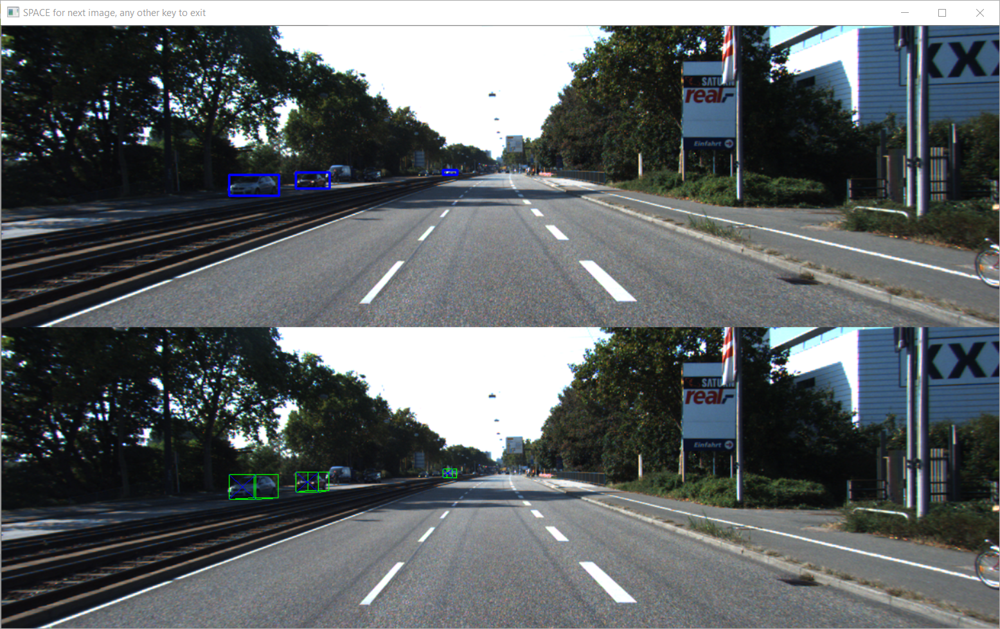

# 3D Bounding Box Estimation Using Deep Learning and Geometry

## Introduction
PyTorch implementation for this [paper](https://arxiv.org/pdf/1612.00496.pdf).



At the moment, it takes approximately 0.4s per frame, depending on the number of objects
detected.

Run through all images in default directory (eval/image_2/), optionally with the 2D
bounding boxes also drawn. Press SPACE to proceed to next image, and any other key to exit.
```
python Run.py --show-yolo
```

There is also a script provided to run on a video from Kitti in ./eval/video.
```
python Run.py --video
```

## Training
First, the data must be downloaded from [Kitti](http://www.cvlibs.net/datasets/kitti/eval_object.php?obj_benchmark=2d).
Download the left color images, the training labels, and the camera calibration matrices. Total is ~13GB.
Unzip the downloads into the Kitti/ directory.

```
python Train.py
```
By default, the model is saved every 10 epochs in weights/.
The loss is printed every 10 batches. The loss should not converge to 0! The loss function for
the orientation is driven to -1, so a negative loss is expected. The hyper-parameters to tune
are alpha and w (see paper). I obtained good results after just 10 epochs, but the training
script will run until 100.

## How it works
The PyTorch neural net takes in images of size 224x224 and predicts the orientation and
relative dimension of that object to the class average. Thus, another neural net must give
the 2D bounding box and object class. I chose to use YOLOv3 through OpenCV.
Using the orientation, dimension, and 2D bounding box, the 3D location is calculated, and then
back projected onto the image.

There are 2 key assumptions made:
1. The 2D bounding box fits very tightly around the object
2. The object has ~0 pitch and ~0 roll (valid for cars on the road)

## Resources
I started from this [repo](https://github.com/fuenwang/3D-BoundingBox), and some of the original code still exists in the training script.